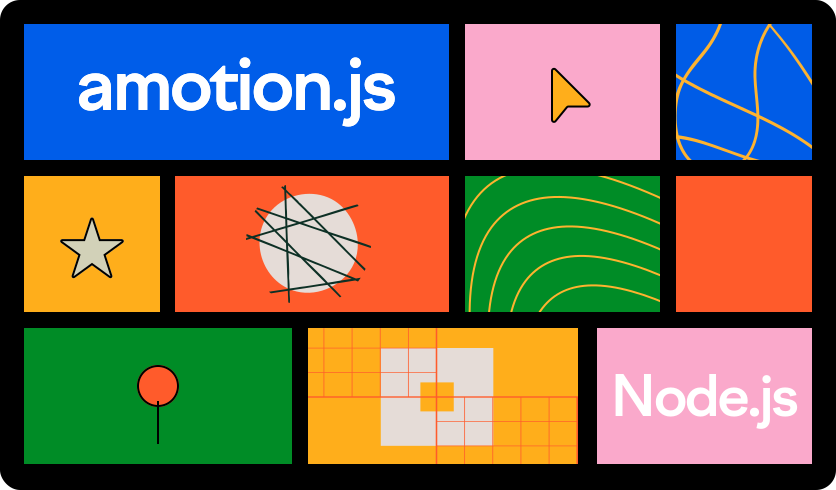

Быстрая и простая библиотека написанная на typescript для создания микросервисов и более сложных веб-сервисов на Node.js

## Быстрое начало
1. Установите библиотеку через команды `npm install amotion` или `yarn add amotion`
2. Создайте файл app.js и вставьте этот код:
   ```javascript
   const Amotion = require('amotion')
   const app = new Amotion()

   // Добавление роута
   app.get('/', async (ctx) => 'Hello, world!');
   
   // Запуск приложения
   (async () => {
      try {
          await app.start(8000)
      } catch (e) {
          console.error(e)
          process.exit(1)
      }
   })()
   ```
3. Запустите приложение через терминал `node ./app.js`

## Контекст
Это класс включающий в себя информацию о запросе `Request` и конструктор ответа на запрос `Reply`, плюс независимый `state` в который можно вкладывать любые данные и значения, которые вам помогут сформировать ответ на запрос.
Ниже будет подробное описание все что входит в `Context`
### Request
- [x] .id - индификационный ключ запроса
- [x] .method - метод запроса к серверу
- [ ] .query - проанализированная строка запроса
- [x] .url - полный путь (пример: "/oauth/facebook?callbackURL=http://localhost:8080/cb)
- [ ] .path - путь без строки запроса (пример: /oauth/facebook)
- [ ] .body - тело запроса
- [x] .headers - заголовки запроса
- [x] .raw - Входящий HTTP-запрос
### Reply
### Cookies


