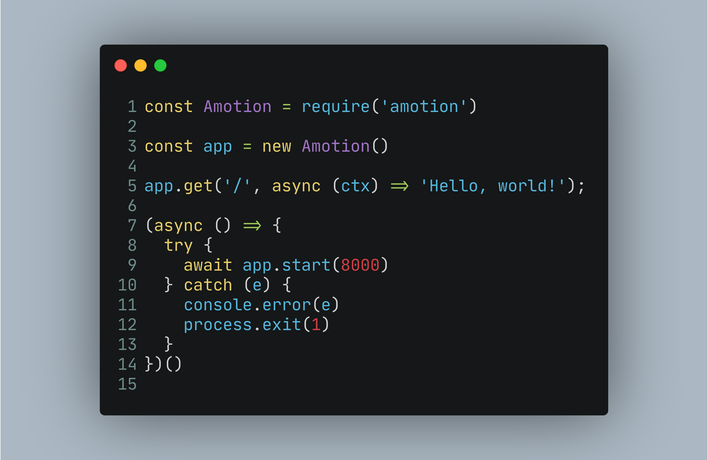

Простая, легкая и гибкая библиотека для создания разнойсложности веб-серверов на базе Node.js

## Быстрое начало
1. Установите библиотеку через команды `npm install amotion` или `yarn add amotion`
2. Создайте файл app.js и вставьте этот код:
   
3. Запустите приложение через терминал `node ./app.js`
